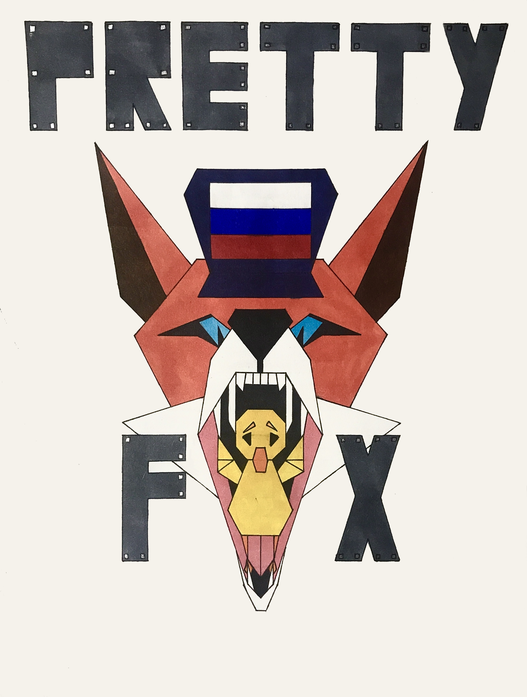

<h2 align="center"><u>PrettyFox</u></h2>

 
    
    
    
    
    

### [+] Description
Program PrettyFox made to protect people from vulnerability BadUSB.

### [+] Installation
 - `git clone https://github.com/TheGodfatherru/PrettyFox.git`
 - `cd PrettyFox`
 - `chmod +x installer.sh`
 - `./installer.sh`

### [+] Usage
 - `./chmod +x main.sh`
 - `./main.sh`

